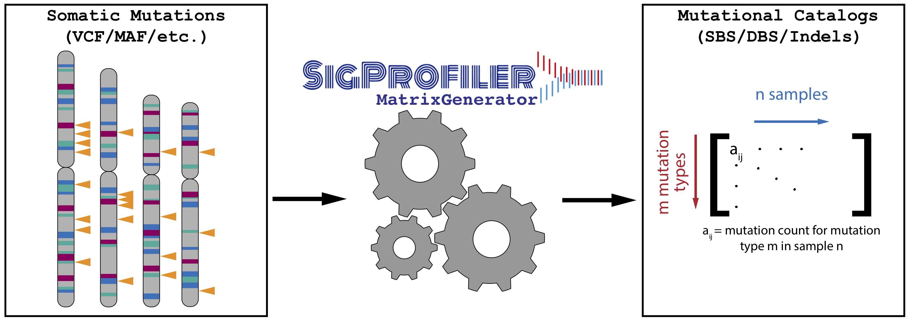

[](https://osf.io/s93d5/wiki/home/) [](https://opensource.org/licenses/BSD-2-Clause) [](https://travis-ci.com/AlexandrovLab/SigProfilerMatrixGeneratorR)

# SigProfilerMatrixGeneratorR
An R wrapper for running the SigProfilerMatrixGenerator (https://osf.io/s93d5/wiki/home/) framework.

**INTRODUCTION**

The purpose of this document is to provide a guide for using the SigProfilerMatrixGenerator framework to generate mutational matrices for a set of samples with associated mutational catalogues. An extensive Wiki page detailing the usage of this tool can be found at https://osf.io/s93d5/wiki/home/. For users that prefer working in a Python environment, the tool is written in Python and can be found and installed from: https://github.com/AlexandrovLab/SigProfilerMatrixGenerator



**PREREQUISITES**

devtools  (R) 
```
>> install.packages("devtools")
```
reticulate* (R) 
```
>> install.packages("reticulate")  
```

*Reticulate has a known bug of preventing python print statements from flushing to standard out. As a result, some of the typical progress messages are delayed.

Alternatively, you can set up a conda environment with all the prerequisites. You can download minicoda for your operating system [here](https://docs.conda.io/en/latest/miniconda.html) and follow the instructions below:

```
conda create --name spmg_r -y
conda activate spmg_r
conda install python=3.10 r-base r-devtools r-reticulate -c conda-forge -y
```

**QUICK START GUIDE**

This section will guide you through the minimum steps required to create mutational matrices:
1. First, install the python package using pip. The R wrapper still requires the python package:
```
                          pip install SigProfilerMatrixGenerator
```
2. Open an R session and ensure that your R interpreter recognizes the path to your python3 installation:
```
$ R
>> library(reticulate)
>> use_python("[path_to_your_python3]") # if using conda the path will be [path_to_your_conda]/envs/spmg_r/bin/python
>> py_config()
python:         /anaconda3/bin/python3
libpython:      /anaconda3/lib/libpython3.6m.dylib
pythonhome:     /anaconda3:/anaconda3
version:        3.6.5 |Anaconda, Inc.| (default, Apr 26 2018, 08:42:37)  [GCC 4.2.1 Compatible Clang 4.0.1 (tags/RELEASE_401/final)]
numpy:          /anaconda3/lib/python3.6/site-packages/numpy
numpy_version:  1.16.1
```
If you do not see your python3 path listed, restart your R session and rerun the above commands in order.

2. Install SigProfilerMatrixGeneratorR using devtools:
```
>>library(devtools)
>>install_github("AlexandrovLab/SigProfilerMatrixGeneratorR")
```
3. Load the package in the same R session and install your desired reference genome as follows (available reference genomes are: GRCh37, GRCh38, mm9, and mm10):
```
>> library("SigProfilerMatrixGeneratorR")
>> install('GRCh37', rsync=FALSE, bash=TRUE)
```

This will install the human 37 assembly as a reference genome.

4. Place your vcf files in your desired output folder. It is recommended that you name this folder based on your project's name

5. From within the same R session, you can now generate the matrices as follows:
```
>> library("SigProfilerMatrixGeneratorR")
>> matrices <- SigProfilerMatrixGeneratorR("BRCA", "GRCh37", "[path_to_repo]/test_data/SBS", plot=T, exome=F, bed_file=NULL, chrom_based=F, tsb_stat=False, seqInfo=False, cushion=100)
```
  The layout of the required parameters are as follows:
  
      SigProfilerMatrixGeneratorFunc(project, reference_genome, path_to_input_files)
      
  where project, reference_genome, and path_to_input_files must be strings (surrounded by quotation marks, ex: "test"). Optional parameters include:
      
      exome=FALSe:       [boolean] Downsamples mutational matrices to the exome regions of the genome
      bed_file=NULL      [string path to bed_file] Downsamples mutational matrices to custom regions of the genome. Requires the full path to the BED file. 
      chrom_based=FALSE  [boolean] Outputs chromosome-based matrices
      plot=FALSE         [boolean] Integrates with SigProfilerPlotting to output all available visualizations for each matrix. 
      tsb_stat=FALSE     [boolean] Outputs the results of a transcriptional strand bias test for the respective matrices. 
      seqInfo=FALSE      [boolean] Ouputs original mutations into a text file that contains the SigProfilerMatrixGenerator classificaiton for each mutation. 
      cushion=100        [integer] Adds an Xbp cushion to the exome/bed_file ranges for downsampling the mutations.
  


**INPUT FILE FORMAT**

This tool currently supports maf, vcf, simple text file, and ICGC formats. The user must provide variant data adhering to one of these four formats. If the user’s files are in vcf format, each sample must be saved as a separate files. 


**Output File Structure**

The output structure is divided into three folders: input, output, and logs. The input folder contains copies of the user-provided input files. The outputfolder contains
a DBS, SBS, ID, and TSB folder (there will also be a plots folder if this parameter is chosen). The matrices are saved into the appropriate folders. The logs folder contains the error and log files for the submitted job.


**SUPPORTED GENOMES**

This tool currently supports the following genomes:

GRCh38.p12 [GRCh38] (Genome Reference Consortium Human Reference 37), INSDC
Assembly GCA_000001405.27, Dec 2013. Released July 2014. Last updated January 2018. This genome was downloaded from ENSEMBL database version 93.38.

GRCh37.p13 [GRCh37] (Genome Reference Consortium Human Reference 37), INSDC
Assembly GCA_000001405.14, Feb 2009. Released April 2011. Last updated September 2013. This genome was downloaded from ENSEMBL database version 93.37. 

GRCm38.p6 [mm10] (Genome Reference Consortium Mouse Reference 38), INDSDC
Assembly GCA_000001635.8, Jan 2012. Released July 2012. Last updated March 2018. This genome was downloaded from ENSEMBL database version 93.38. 

GRCm37 [mm9] (Release 67, NCBIM37), INDSDC Assembly GCA_000001635.18.
Released Jan 2011. Last updated March 2012. This genome was downloaded from ENSEMBL database version release 67.

rn6 (Rnor_6.0) INSDC Assembly GCA_000001895.4, Jul 2014. Released Jun 2015. Last updated Jan 2017. 
This genome was downloaded from ENSEMBL database version 96.6.

**LOG FILES**

All errors and progress checkpoints are saved into *sigProfilerMatrixGenerator_[project]_[genome].err* and *sigProfilerMatrixGenerator_[project]_[genome].out*, respectively. 
For all errors, please email the error and progress log files to the primary contact under CONTACT INFORMATION.

**CITATION**

Bergstrom EN, Huang MN, Mahto U, Barnes M, Stratton MR, Rozen SG, Alexandrov LB: SigProfilerMatrixGenerator: a tool for visualizing and exploring patterns of small mutational events. BMC Genomics 2019, 20:685
https://bmcgenomics.biomedcentral.com/articles/10.1186/s12864-019-6041-2


**COPYRIGHT**

Copyright (c) 2020, Erik Bergstrom [Alexandrov Lab] All rights reserved.

Redistribution and use in source and binary forms, with or without modification, are permitted provided that the following conditions are met:

Redistributions of source code must retain the above copyright notice, this list of conditions and the following disclaimer.

Redistributions in binary form must reproduce the above copyright notice, this list of conditions and the following disclaimer in the documentation and/or other materials provided with the distribution.

THIS SOFTWARE IS PROVIDED BY THE COPYRIGHT HOLDERS AND CONTRIBUTORS "AS IS" AND ANY EXPRESS OR IMPLIED WARRANTIES, INCLUDING, BUT NOT LIMITED TO, THE IMPLIED WARRANTIES OF MERCHANTABILITY AND FITNESS FOR A PARTICULAR PURPOSE ARE DISCLAIMED. IN NO EVENT SHALL THE COPYRIGHT HOLDER OR CONTRIBUTORS BE LIABLE FOR ANY DIRECT, INDIRECT, INCIDENTAL, SPECIAL, EXEMPLARY, OR CONSEQUENTIAL DAMAGES (INCLUDING, BUT NOT LIMITED TO, PROCUREMENT OF SUBSTITUTE GOODS OR SERVICES; LOSS OF USE, DATA, OR PROFITS; OR BUSINESS INTERRUPTION) HOWEVER CAUSED AND ON ANY THEORY OF LIABILITY, WHETHER IN CONTRACT, STRICT LIABILITY, OR TORT (INCLUDING NEGLIGENCE OR OTHERWISE) ARISING IN ANY WAY OUT OF THE USE OF THIS SOFTWARE, EVEN IF ADVISED OF THE POSSIBILITY OF SUCH DAMAGE. 

**CONTACT INFORMATION**

Please address any queries or bug reports to Erik Bergstrom at ebergstr@eng.ucsd.edu
